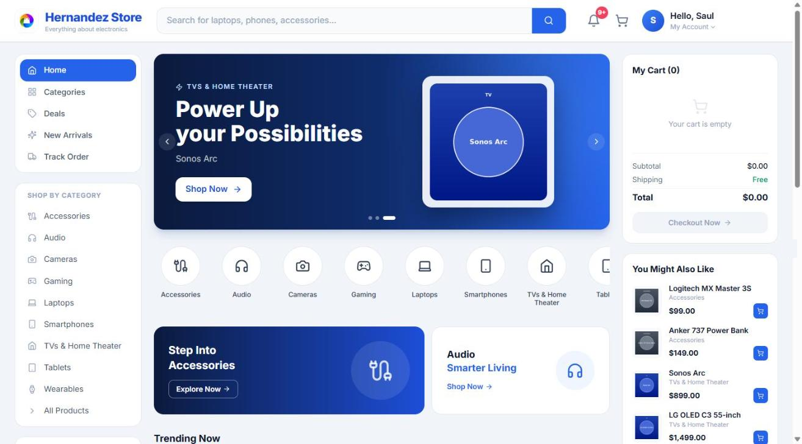
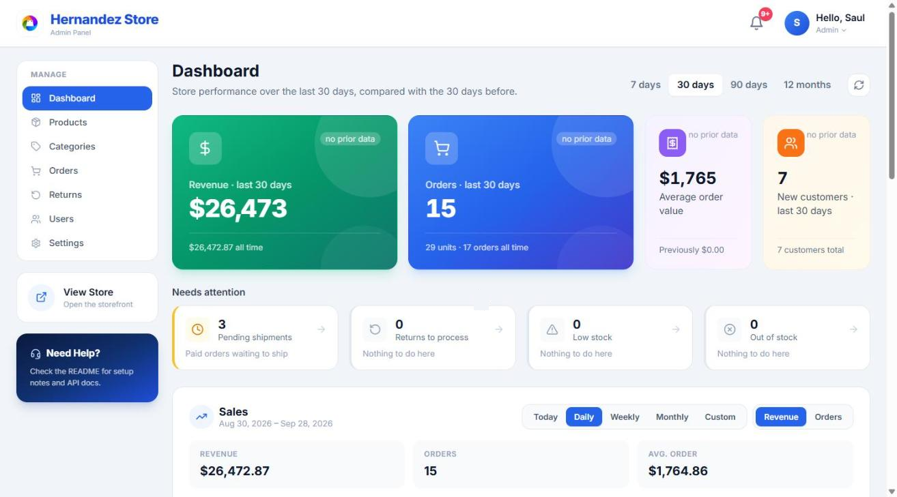
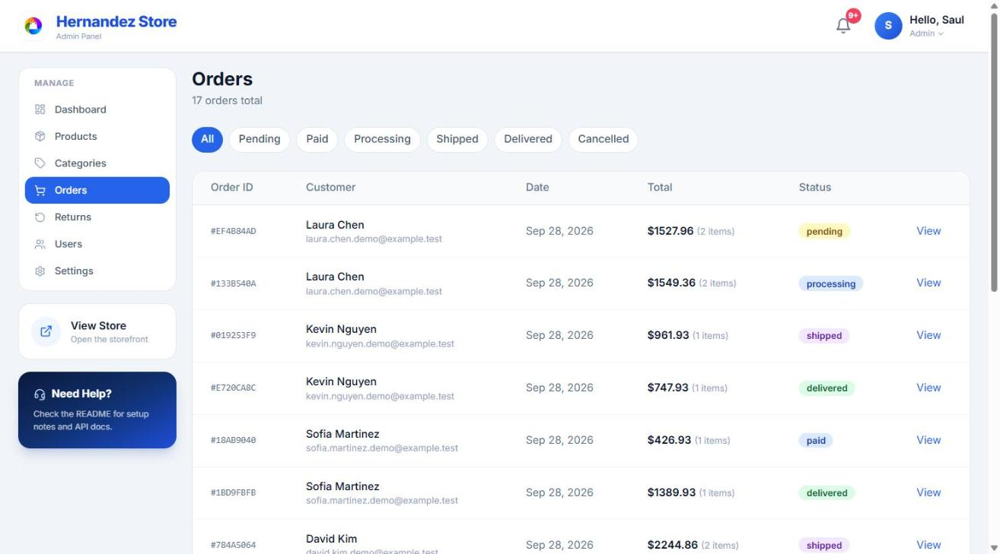
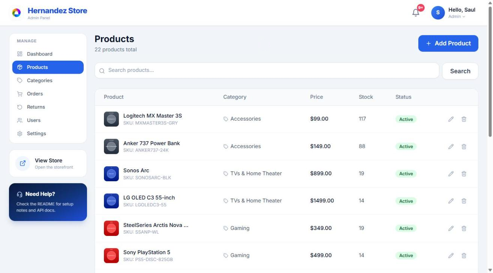

# Ecommerce

A full-stack e-commerce platform with a customer storefront, an admin dashboard, and a companion mobile app, all sharing one Node.js/Express API backed by PostgreSQL and Redis. The system implements real-time stock reservations, idempotent checkout, and multi-client authentication — patterns closer to production commerce systems than to a typical CRUD demo.

<p align="left">
  
  
  
  
  
  
  
  
  
  
  
  
  
  
  
</p>

## Screenshots

> Captured from a local instance seeded with demo customers and orders.

| Storefront | Admin dashboard |
|---|---|
|  |  |
| **Order management** | **Product management** |
|  |  |

## Overview

This repository is a monorepo for an e-commerce system made up of three applications that share a single backend API and data model:

- **`backend/`** — REST API built with Node.js and Express, backed by PostgreSQL and Redis, with JWT-based authentication, row-level stock reservations, idempotent order placement, and Cloudinary-powered image uploads.
- **`frontend/`** — Customer-facing web storefront and admin dashboard built with React, TypeScript, and Vite, served in production through Nginx.
- **`mobile/`** — Cross-platform iOS/Android app built with React Native and TypeScript, sharing the same API, auth model, and Redux data layer as the web client.

## Key Features

### Storefront & checkout
- Product catalog with categories, subcategories, search, and per-product image galleries
- Real-time **stock reservation ("hold") system**: adding an item to a cart places a time-boxed, row-locked hold on stock (`SELECT … FOR UPDATE`) so two shoppers can't both check out the last unit; holds auto-renew while active, auto-expire after a few minutes via a background sweep job, and are surfaced to the shopper through a live countdown banner (web `HoldBanner` / mobile `HoldNotice`) that flags partial or sold-out lines
- Guest carts identified by a client-generated cart token (`X-Cart-Token`), synced to the server and reconciled with server-side availability
- **Idempotent checkout**: order placement accepts an `Idempotency-Key` header so a retried request (flaky network, double-tap) replays the original result instead of creating a duplicate order
- **Card payments with Stripe Checkout** (hosted payment page) alongside Cash on Delivery, on web and mobile; orders are confirmed by a signed webhook, with a return-time check and a background sweep as fallbacks, and abandoned payments release their stock
- Cart sidebar, address entry, and multi-step checkout flow
- Order history, order detail, and shipment tracking with carrier-aware tracking URLs
- Return/refund request workflow with itemized return line items
- Tax calculation at checkout driven by the store's tax settings
- Account profile management and persistent notifications (order status, shipping with carrier and tracking number) with unread badges, mark-as-read and delete

### Admin dashboard
- First-run **Setup Wizard** for initial store configuration (name, logo, currency, tax rate, return window, timezone) — the app redirects here until a store record exists
- Store branding with an uploadable logo shown across the storefront and admin layouts
- Product, category, and subcategory management with drag-friendly multi-image upload and primary-image selection
- Order management with status transitions, carrier and tracking number capture on shipment, and per-order detail views
- Returns queue for staff/admin review and approval
- User management with role assignment
- Store settings (currency, tax, timezone-aware formatting via a dedicated `TimeZoneSelect`)
- Analytics dashboard: revenue, orders, units sold, average order value and new customers for a selectable period, each with **percent change vs. the previous period**; inventory breakdown with **low-stock and out-of-stock alerts**; top products, recent orders, pending shipments, and a sales trend chart built with Recharts
- Full admin experience on mobile too: dashboard, products, categories, orders, returns, users and settings screens

### Platform, auth & security
- JWT authentication delivered as an httpOnly cookie for the web client and as a `Bearer` token (stored in the OS keychain via `react-native-keychain`) for the mobile client, verified by a shared middleware
- Role-based access control (`admin`, `staff`, `customer`) enforced per-route
- Optional-auth support so guest shoppers can browse and hold stock without an account
- Security middleware: Helmet security headers, scoped CORS with credentials, and endpoint-specific rate limiting (auth, order placement, cart/reservation sync)
- Upload validation by magic-byte file-type sniffing (not just file extension) before accepting images
- Image storage via Cloudinary, with automatic fallback to local disk in development
- Redis-backed response caching for hot read paths (products, categories, dashboard, setup status) with targeted invalidation helpers called on every write
- Background jobs: an expired-hold sweeper for stock reservations and a Stripe sweeper that settles or cancels pending card orders
- Stripe webhook mounted before the JSON body parser so raw-body signature verification works
- Cross-site cookie support (`SameSite=None; Secure`) for deployments where the frontend and API are on different domains
- Dockerized environment (PostgreSQL, Redis, API, web client via Nginx) for one-command local or production startup

## Tech Stack

| Layer | Technologies |
|---|---|
| Web Frontend | React 18, TypeScript, Vite, Redux Toolkit, React Router, Tailwind CSS, Axios, Recharts, react-hot-toast, lucide-react |
| Mobile | React Native 0.87 (React 19), TypeScript, React Navigation (native-stack + bottom-tabs), Redux Toolkit, Axios, AsyncStorage, react-native-keychain, react-native-image-picker, react-native-vector-icons |
| Backend | Node.js, Express 4, JWT (jsonwebtoken), bcrypt, cookie-parser, CORS, Multer, file-type (magic-byte validation), Helmet, express-rate-limit, uuid, dotenv |
| Payments | Stripe (Checkout Sessions + signed webhooks) |
| Data | PostgreSQL 16 (pg), Redis 7 (ioredis), SQL schema + migrations |
| Infrastructure | Docker, Docker Compose (health checks, `no-new-privileges`), Nginx, Cloudinary |
| Tooling | nodemon (backend), PostCSS + Autoprefixer (web), Jest, ESLint and Prettier (mobile) |

## Project Structure

```
Ecommerce/
├── backend/                # Express API
│   └── src/
│       ├── routes/         # auth, setup, categories, products, orders,
│       │                   # payments, stripeWebhook, reservations, returns,
│       │                   # dashboard, users, notifications
│       ├── middleware/     # auth (JWT + roles), upload (Multer + magic-byte
│       │                   # validation), idempotency
│       ├── utils/          # reservations (stock holds), cache (Redis),
│       │                   # stripeOrders, notifications, safeErr, slugify
│       ├── db/              # schema.sql + migrations
│       └── config/          # database, Redis, Stripe, Cloudinary clients
├── frontend/                # React + TypeScript + Vite web app
│   └── src/
│       ├── pages/            # Shop (Home, Product, Cart, Checkout, Orders),
│       │                     # Admin (Dashboard, Products, Categories,
│       │                     # Orders, Returns, Users, Settings), Auth, Setup
│       ├── components/       # Layout (Shop/Admin), Shop (ProductCard,
│       │                     # CartSidebar, HoldBanner, LeftSidebar),
│       │                     # Notifications, StoreLogo, TimeZoneSelect
│       ├── store/             # Redux Toolkit slices (cart, etc.)
│       └── hooks/             # useReservations (stock hold sync/countdown)
├── mobile/                   # React Native app (iOS + Android)
│   └── src/
│       ├── screens/           # Shop + Admin screens mirroring the web app
│       ├── components/        # ProductCard, HoldNotice, shared ui
│       ├── navigation/        # RootNavigator (stack + tabs)
│       ├── store/              # Redux Toolkit slices (cart, settings)
│       └── hooks/              # useReservationSync
└── docker-compose.yml         # postgres, redis, backend, frontend (nginx)
```

## API Overview

All routes are mounted under `/api`:

| Base path | Purpose |
|---|---|
| `/auth` | Register, login, logout, current user |
| `/setup` | First-run store configuration status, completion, and logo upload |
| `/categories` | Categories and subcategories (CRUD, admin/staff-gated writes) |
| `/products` | Catalog CRUD, image upload/management, admin listing |
| `/orders` | Order listing, detail, status updates |
| `/payments` | Idempotent order placement (`place-order`), Stripe config, payment confirm/cancel, Stripe webhook |
| `/reservations` | Cart stock holds: get, sync (renew), release |
| `/returns` | Return requests: create, list, review/approve |
| `/dashboard` | Admin analytics: period summary with comparison and stock alerts, top products, recent orders, sales chart, pending shipments |
| `/users` | User listing and management |
| `/notifications` | User notifications: list, mark read, delete |
| `/health` | Health check |

## Getting Started

### Prerequisites

- Node.js (v22+ recommended for the mobile app, v18+ for backend/frontend)
- Docker and Docker Compose
- For mobile development: a configured React Native environment (Android Studio and/or Xcode)

### Run with Docker Compose (backend + frontend + database)

```bash
git clone https://github.com/sahc1987/Ecommerce.git
cd Ecommerce
cp .env.example .env
docker compose up --build
```

This starts PostgreSQL, Redis, the API, and the web frontend (served via Nginx). On first run, the app redirects to `/setup` until an admin completes the store configuration wizard.

### Run services individually

**Backend**

```bash
cd backend
cp .env.example .env
npm install
npm run db:init   # create tables from schema.sql
npm run dev
```

**Frontend**

```bash
cd frontend
cp .env.example .env
npm install
npm run dev
```

**Mobile**

```bash
cd mobile
npm install
npm run ios      # or
npm run android
```

## Environment Variables

Each app (`backend/`, `frontend/`, `mobile/`) includes a `.env.example` file documenting the environment variables it expects. Copy each to `.env` and fill in your own values before running. Notable backend settings:

- `DATABASE_URL`, `REDIS_URL` — PostgreSQL and Redis connections
- `JWT_SECRET` — signing secret for auth tokens
- `CLIENT_URL` — allowed CORS origin
- `CROSS_SITE_COOKIES` — set `true` when the frontend and API are deployed on different domains (enables `SameSite=None; Secure` cookies)
- `CLOUDINARY_CLOUD_NAME` / `CLOUDINARY_API_KEY` / `CLOUDINARY_API_SECRET` — enable Cloudinary image storage; if unset, uploads fall back to local disk (development only)
- `STRIPE_SECRET_KEY` / `STRIPE_WEBHOOK_SECRET` — enable card payments; if unset, checkout offers Cash on Delivery only

### Stripe payments

1. Copy your secret key (`sk_test_…`) from the [Stripe dashboard](https://dashboard.stripe.com/test/apikeys) into `STRIPE_SECRET_KEY`.
2. Point a webhook at `/api/payments/webhook` for the `checkout.session.completed`, `checkout.session.async_payment_succeeded`, `checkout.session.async_payment_failed` and `checkout.session.expired` events, and put its signing secret in `STRIPE_WEBHOOK_SECRET`. Locally, the Stripe CLI does both:

   ```bash
   stripe listen --forward-to localhost:5000/api/payments/webhook   # prints whsec_…
   ```

3. Restart the backend. Test with card `4242 4242 4242 4242`, any future expiry and any CVC.

Webhooks aren't strictly required locally: when a customer returns from Stripe, the app checks the payment directly, and a background job settles any orders left open.

## About the Author

**Saúl Hernández** — Full Stack Developer with 7+ years of experience building web, mobile, and backend systems.

- GitHub: [@sahc1987](https://github.com/sahc1987)
- LinkedIn: [saul-hernandez-dev](https://linkedin.com/in/saul-hernandez-dev)
- Email: [sahc1987@gmail.com](mailto:sahc1987@gmail.com)

## License

No license has been specified for this project yet. All rights reserved by the author unless stated otherwise.
